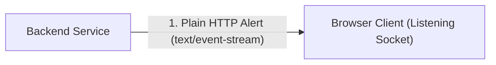
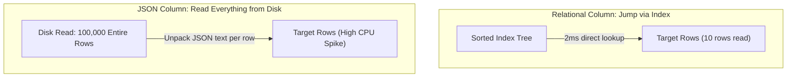
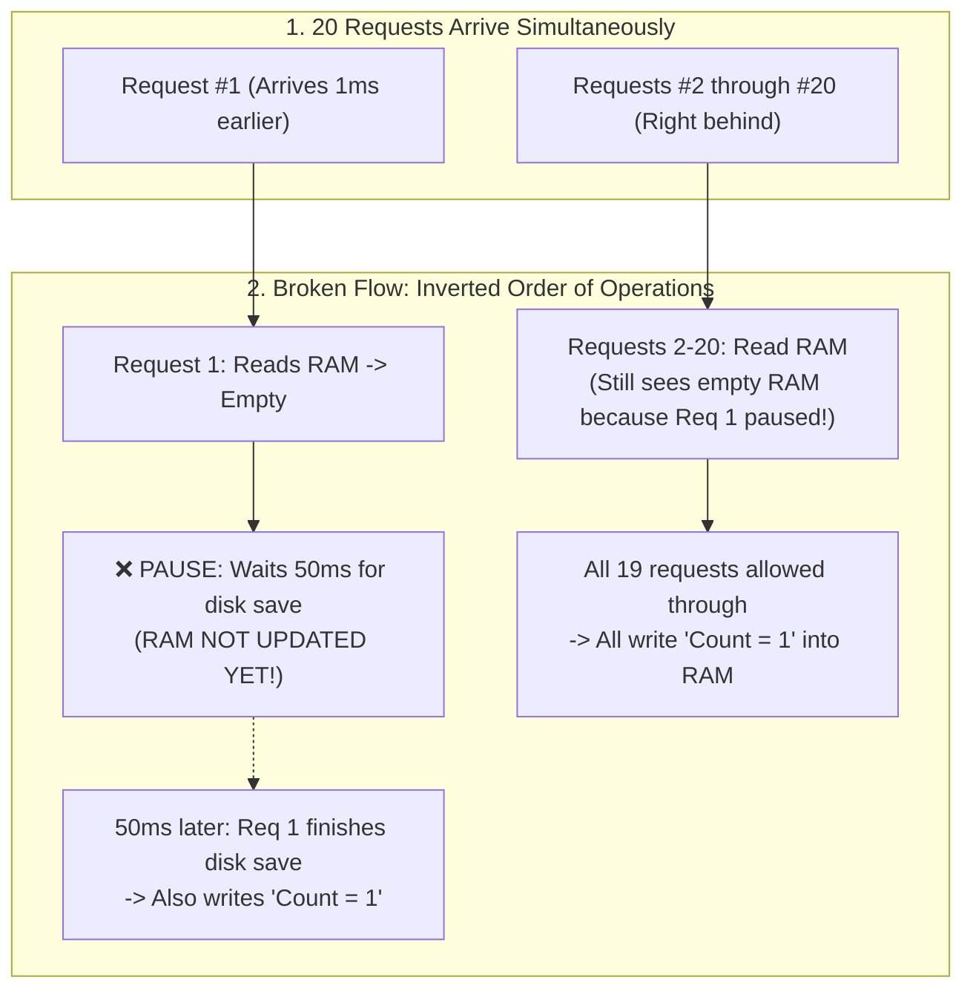
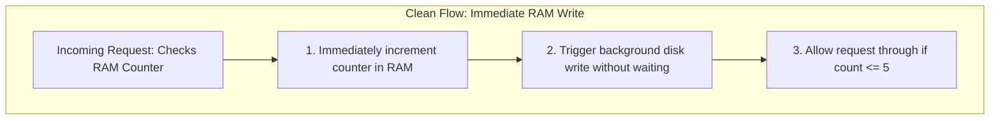
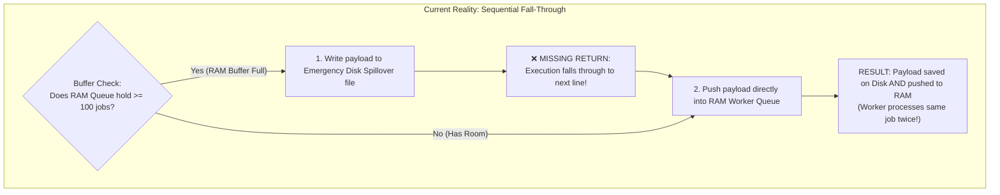
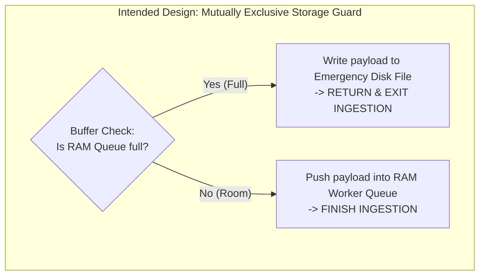

# Reference: Jet Engine Co-Engineer Guide

## 1. Core Ideology: Explain Through the Idea of Tech Terms

Never explain a technical label by throwing another technical label at the reader. Explain the underlying physical mechanics and behavioral intent using real system entities (`RAM`, `disk`, `network`, `requests`, `counters`).

### Translating Software Artifacts into Behavioral Actions

| Technical Concept / Code Artifact | ❌ What NOT to Say (Jargon / AST Dump) | ❌ What NOT to Say (Cringe / Fantasy Titles) | ✔ What to Say Instead (Functional Role on Physical Medium) |
| :--- | :--- | :--- | :--- |
| **In-Memory Map / Cache** | `Heap Map<string, object>`, `Key-Value Store` | *The Fast Vault*, *Két Sắt RAM* | *The fast counter/list stored in temporary RAM* |
| **Rate Limiter / Guard** | `TokenBucketLimiter.isAllowed()`, `Middleware` | *The Gatekeeper Bouncer*, *Người Gác Cổng* | *The check in RAM verifying if a user exceeded allowed requests* |
| **Timeout / Retry Loop** | `while(true) with setTimeout & throw` | *Bộ Canh Khóa Kéo*, *Cầu Chì 10s* | *The retry loop in RAM pausing 200ms for mouse release, aborting after 10s* |
| **State / Tab Validation** | `chrome.tabs.get(id)`, `tab.windowId` | *Đầu Dò Kiểm Tra Tab*, *The Scout Probe* | *The check verifying if the dragged tab is still open in this window* |
| **Async Pause / I/O Yield** | `await flushToDisk()`, `Microtask queue yield` | *The Great Sleep Chamber* | *Waiting 50ms for a slow disk save before updating RAM* |
| **Disk Spillover / Overflow** | `EmergencyDiskSpooler.append()` | *The Emergency Disk Spooler* | *Appending overflow jobs to a backup file on disk when RAM is full* |
| **Reconciliation / GC** | `State reconciliation loop`, `Garbage collection` | *The Garbage Goblin*, *Bộ Bóc Tách* | *Reading the destination list and asking source to delete leftovers* |
| **Race Condition** | `Non-atomic concurrent read-modify-write` | *The Double-Cross Duel* | *Two requests reading the same count from RAM before either writes back* |
| **Deadlock** | `Circular resource lock acquisition failure` | *The Mexican Standoff* | *Two operations holding each other's keys and both waiting* |
| **Cache Invalidation** | `Cache invalidation / eviction TTL` | *The Vault Purge* | *Throwing away the fast RAM copy when the main database on disk changes* |
| **AST / Parsing Drift** | `AST representation out of sync with disk` | *The Mirror Illusion* | *Looking at an old cached copy in memory instead of the actual file on disk* |
| **Backpressure** | `TCP flow control / reactive streams backpressure` | *The Traffic Cop* | *Telling the sender over the network to pause because incoming requests are piling up in RAM* |
| **Atomic Transaction** | `ACID atomic transaction boundary` | *The Magic Bundle* | *Bundling 5 database writes together on disk so if step 4 fails, steps 1-3 undo instantly* |

---

## 2. Diagram Node Labels & Topology Patterns

Diagrams must communicate data paths and operational states at a glance. Label nodes with real entities and behavioral actions.

### A. Labeling Anti-Patterns vs Good Behavioral Labels

| Element | ❌ BAD (Reading Code Aloud / AST Dump) | ✔ GOOD (Real Entity & Behavioral Action) |
| :--- | :--- | :--- |
| **Condition Node** | `if (user.activeConnections >= config.MAX_LIMIT)` | `Gateway checks: Does user already have 10 open connections?` |
| **State Buffer Node** | `this.pendingQueue = new Array(capacity = 50)` | `RAM Queue Buffer (Holds up to 50 pending jobs in memory)` |
| **Action Node** | `await this.store.flushToDisk()` | `❌ PAUSE: Wait 50ms for disk save (RAM not updated yet!)` |
| **Mutation Node** | `await db.insert(record); notifyChannel.emit(event);` | `1. Writes record to database table 2. Immediately pushes live alert down socket` |
| **Error / Retry Node** | `catch (e) { this.retryCount++; retryQueue.push(job); }` | `On connection failure: Bumps retry count to 1 and re-queues job` |

### B. Graph Topology Patterns: Fall-Through vs Clean Guard

| Flow Pattern | ❌ BAD (Misleading Parallel Fork) | ✔ GOOD (True Sequential Fall-Through) |
| :--- | :--- | :--- |
| **Missing Return / Fall-Through** | `Diamond --> BranchA` `Diamond --> BranchB` | `Diamond -- Yes --> Action 1 --> Action 2 (Continues sequentially)` `Diamond -- No --> Action 2` |

---

## 3. Explanation Styles Compared

| Dimension | Style 1: Abstract Jargon (Opaque) | Style 2: Cringe / Detached Metaphor (Distorted) | Style 3: Jet Engine Infant (Optimal) |
| :--- | :--- | :--- | :--- |
| **Language** | `"Unidirectional sync without garbage collection."` | `"The pizza delivery guy dropped the box"` or `"The Save Vault locked the door."` | `"The computer copies from A to B, but never checks B to delete old files."` |
| **Target Entities** | Abstract CS concepts | Unrelated real-world objects (pizza, bouncers) or fantasy steampunk titles (*The Save Vault*, *Bộ Canh Khóa*) | **Real system components (`RAM`, `disk`, `network`) and literal functional actions** |
| **Understanding** | Accessible only to domain specialists | Feels accessible, but distorts reality and sounds cartoonish | **100% accurate mental model in plain English without cringe** |
| **Actionability** | User cannot reason about the fix | User cannot map metaphor/fantasy names to actual code lines | **User can immediately collaborate on the exact solution** |

---

## 4. Multi-Mode Case Studies

### Mode A: Architecture Planning (Live Notification System)

* **Step 1 (BLUF):**  
  We should use Server-Sent Events (SSE) instead of WebSockets because the server only needs to push one-way alerts to the browser, and SSE runs over plain HTTP without needing a separate connection server.
* **Step 2 (Physical Mechanics & Visualization):**  

  1. The browser initiates a standard HTTP request and leaves the socket open.
  2. Whenever a notification occurs, the backend flushes a UTF-8 text line down that open socket.
  3. The browser immediately receives the line without needing two-way heartbeat tunnels.
* **Step 3 (Point of Friction / Tradeoff):**  
  WebSockets keeps a two-way tunnel open and requires custom ping/pong heartbeats. For simple one-way notifications, that extra machinery adds maintenance overhead without providing any two-way benefits.
* **Step 4 (Concrete Decision & Next Action):**  
  We create a single `/api/events` endpoint in `src/server.ts` and connect the frontend with `EventSource`. Do you want to review the endpoint code?

---

### Mode B: Technical Debate / Tradeoff (JSON Column vs SQL Table)

* **Step 1 (BLUF):**  
  We should put `status` and `user_id` in separate SQL columns and only keep custom user tags in a `metadata` JSON column, because filtering inside JSON across 100,000 rows forces the database to read every single row from disk.
* **Step 2 (Physical Mechanics & Visual Contrast):**  

  1. **Relational Path:** The database traverses a pre-sorted index tree on disk (reading ~3 index pages), directly locates the 10 matching row pointers, and reads only those 10 rows into RAM. Total time: ~2ms.
  2. **JSON Blob Path:** Because keys inside JSON are unstructured text, the database has no index pointers. It must read all 100,000 table rows from disk into memory, parse the text of every row, and check the string value. Total time: ~450ms with 100% CPU usage.
* **Step 3 (Point of Friction / Tradeoff):**  
  Putting all fields in JSON saves 5 minutes of schema migration today, but causes database CPU to spike to 100% as soon as table size grows past 10,000 records.
* **Step 4 (Concrete Decision & Next Action):**  
  We define explicit SQL columns for `id`, `status`, and `user_id`, and keep `metadata` JSON only for unstructured custom tags. Shall we write the database migration script?

---

### Mode C: System Debugging (Concurrent State Overwrite in Rate Limiter)

* **Step 1 (BLUF):**  
  The rate limiter allowed all 20 concurrent requests instead of capping at 5 because the system paused to wait for a slow disk save before recording the first request in RAM, causing all 19 subsequent requests to check an empty RAM counter and independently mark themselves as request #1.
* **Step 2 (Physical Mechanics & Visual Contrast):**  

#### Current Code (Broken Flow: Inverted Order Creates a Stale Memory Window)

#### How We Can Fix It (Immediate Synchronous RAM Update)

* **Step 3 (Point of Friction / Gap):**  
  The physical sequence of operations was inverted:
  - *Correct:* Update counter in RAM immediately $\rightarrow$ Trigger background disk save without waiting.
  - *Current (Broken):* Wait for disk save $\rightarrow$ Only then write counter to RAM.
  The 50ms pause created a blind window where incoming callers acted on stale RAM state.
* **Step 4 (Concrete Decision & Next Action):**  
  We reverse the order: write the updated counter into RAM synchronously first, and let the disk save run in the background without blocking the request path.

---

### Mode D: Layered System Explanation ("Just Explain" with Visual Contrast)

* **Task:** *"Explain how this background job ingestion and processing service works."*

* **1. The Raw Core Idea:**  
  Web servers crash when thousands of users upload high-resolution files simultaneously. This service acts as an **in-memory staging buffer**: it absorbs incoming jobs into fast RAM, spills excess payloads to an emergency disk file when RAM is full, and worker threads process jobs continuously in the background.

  **In short:** Sudden bursts of heavy uploads crash web server RAM ➔ Buffer jobs in fast RAM, spill excess to disk, and let background worker threads drain the queue.

* **2. High-Level Movement & Visual Contrast:**  

#### Current Code (Broken Flow: Sequential Fall-Through Causes Duplicate Processing)

#### How We Can Fix It (Mutually Exclusive Storage Guard)

* **The Moving Parts & Data Paths:**
  - *Ingestion Handler:* Validates incoming job payloads and checks current RAM buffer capacity.
  - *RAM Queue Buffer:* Fast FIFO array in memory holding up to 100 jobs for instant worker pickup.
  - *Emergency Disk File:* File append stream on disk that safely stores overflow jobs when RAM is saturated.

* **3. Real Operational Boundaries:**  
  1. *Threshold Desynchronization:* The ingest handler checks a 100-job threshold, but the internal RAM buffer allows up to 200 items before throwing out-of-memory errors.
  2. *Missing Guard:* When RAM is full, the handler writes to disk but fails to return early, accidentally pushing the job into RAM as well.
* **4. Progressive Depth Check-in:**  
  Does this surface layer give you the mental model you need, or do you want to drill into:
  - **(A)** How worker threads drain the emergency disk spillover file once RAM clears, or
  - **(B)** Gating the ingestion handler with an explicit early return branch?
