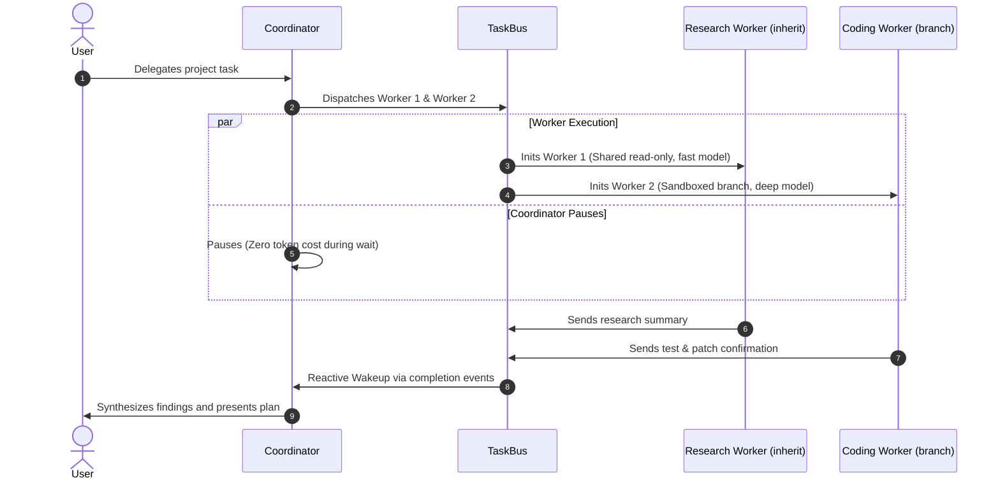
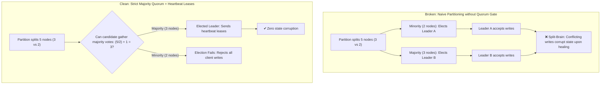
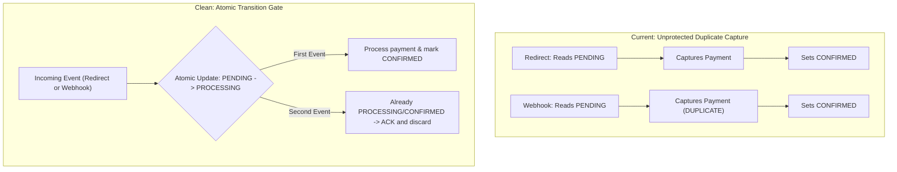
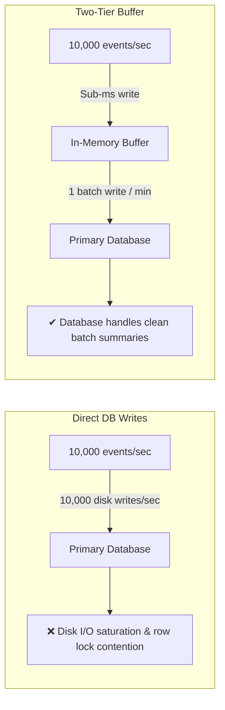

# Reference: Jet Engine Co-Engineer Guide

---

## 1. Concept Translation Dictionary

Translate complex technical concepts into literal domain mechanics:

### Business & Domain Logic

| Concept | ❌ Jargon / Bad Metaphor | ✔ Functional Mechanics |
| :--- | :--- | :--- |
| **Idempotency** | Deduplication token / Magic Coin Slot | Deduplicate by transaction ID so retrying does not charge twice. |
| **Optimistic Locking** | OCC version column / Trusting Clerk | Let users edit freely, but verify document version before saving to prevent overwrites. |
| **State Transition** | FSM predicate / Escalator of Destiny | Strict progression rules: an order cannot move to 'Shipped' unless already in 'Paid' status. |
| **Atomic Transaction** | ACID 2PC boundary / All-or-Nothing Spell | Bundle steps (deduct stock, charge card) so if charging fails, stock deduction auto-reverses. |
| **Reconciliation** | Asynchronous reconciliation loop / Goblin Cleaner | Periodically compare bank records against internal ledger and create adjustment entries. |

### Distributed Systems & Consensus

| Concept | ❌ Jargon / Bad Metaphor | ✔ Functional Mechanics |
| :--- | :--- | :--- |
| **Leader Election** | Raft quorum RPC / King's Crown Contest | Nodes vote for a leader; majority winner takes charge and sends heartbeats. |
| **Split-Brain Prevention** | Quorum intersection / Two Rival Monarchs | Require decisions to have majority approval (`> N/2`), preventing isolated nodes from writing. |
| **Message Broker** | Pub-sub event broker / Town Crier | Central board where services post events and listeners pick them up independently. |
| **Backpressure** | Reactive flow control / Traffic Cop | Tell upstream sender to slow down when the processing queue is full. |
| **Circuit Breaker** | Circuit breaker FSM / Electric Fuse | Pause calls to a failing external service for 30s to prevent system hangs, then test with 1 probe. |

### Concurrency & State Dynamics

| Concept | ❌ Jargon / Bad Metaphor | ✔ Functional Mechanics |
| :--- | :--- | :--- |
| **State Reservation (Lease)** | OCC lease with TTL / Melting Ice Key | Temporarily reserve a slot during processing; auto-release if processing hangs. |
| **Stale Result Drop** | Epoch fencing token / Expired letters | Discard late calculation results if their reservation window already timed out. |
| **Race Condition** | Non-atomic read-modify-write / Grabbing same toy | Two actions check available space at the exact same millisecond and both proceed, exceeding capacity. |
| **Rate Limiting** | Token bucket middleware / Club Bouncer | Cap users at 100 requests/minute; reject excess requests immediately with retry delay. |

### Storage & Performance

| Concept | ❌ Jargon / Bad Metaphor | ✔ Functional Mechanics |
| :--- | :--- | :--- |
| **Two-Tier Storage** | Tiered write-back buffer / Vault Waiting Room | Store high-frequency counters in fast memory and flush aggregated batches to database once per minute. |
| **Lock Contention** | Row-level exclusive lock / Toll Booth Jam | Multiple requests updating the same record simultaneously, forcing execution into single-file queue. |
| **Eventual Consistency** | Gossip replication / Rumors in town | Allow local branches to write immediately, syncing and reconciling with headquarters shortly after. |

### AI Multi-Agent Orchestration

| Concept | ❌ Jargon / Bad Metaphor | ✔ Functional Mechanics |
| :--- | :--- | :--- |
| **Task Delegation** | Subagent RPC dispatch / Mini-Me Quest | Lead agent delegates sub-task to a worker agent, waits for report, then integrates results. |
| **Passive Waiting** | Reactive wait vs busy-wait / CPU sleep loop | Coordinator pauses at zero token cost and wakes up only when an event arrives in inbox. |
| **Context Window Limit** | Token budget exhaustion / Short-Term Brain Box | Conversation reaches max capacity AI can read in one turn, requiring older notes to be summarized or offloaded. |
| **Workspace Isolation** | Worktree git branch sandbox / Parallel universes | Give workers private copies or sandboxed branches so concurrent edits never collide. |
| **Fan-Out Bound** | Hierarchical depth invariant / Family Tree Pruner | Cap agent nesting at Max Depth = 2 (Lead -> Subagent -> Leaf) to prevent runaway spawning. |

---

## 2. Universal Domain Mapping Guide

*These 4 categories apply to complex multi-component or distributed architectures. For standalone scripts, tools, or localized bugs, describe only the directly relevant mechanics.*

| Domain | 1. Identity & Role | 2. Resource & Isolation | 3. Permissions & Limits | 4. Lifecycle & Signaling |
| :--- | :--- | :--- | :--- | :--- |
| **AI Multi-Agents** | Agent Type & Role Name | Workspace (`inherit`, `branch`, `share`) | Tool access, Max Depth = 2 | Event messaging, 0-token idle, active kill |
| **Distributed Consensus (Raft)** | Node State (`Follower`, `Candidate`, `Leader`) | Local State Machine Log & Partition | Majority Quorum Gate (`(N/2) + 1`) | Heartbeat leases, election timeouts, term bumps |
| **Game Concurrency** | Player & Item Entity Role | Pending Reservations vs Filled Slots | Capacity check formula & frame window | Synchronous reservation, safety lease, stale drop |
| **E-Commerce Payment** | Order Status & Webhook ID | Transaction isolation & row locks | Single-transition gate (`PENDING` -> `PROCESSING`) | Webhook callback, 30s timeout, idempotent ACK |
| **High-Throughput Storage** | Ingestion Worker & DB Writer | In-memory buffer vs disk storage | Batch limit ceiling (50,000 events) | 60s scheduled flush, crash loss boundary |

---

## 3. Explanation Styles Compared

| Style | Example Phrasing | Flaw / Value |
| :--- | :--- | :--- |
| **Abstract CS Jargon** | *"Non-atomic read-modify-write causes state divergence."* | ❌ Opaque; obscures physical mechanics. |
| **Fantasy Metaphor** | *"The pizza baker dropped dough because the kitchen goblin slept."* | ❌ Childish; distorts real system levers. |
| **Hardware Overkill** | *"Request pauses 50ms for disk write while Request 2 reads 0x12."* | ❌ Distracting low-level noise. |
| **Domain Mechanics (Standard)** | *"Two users save at the same millisecond; the second save overwrites the first without checking."* | ✔ **100% domain-accurate, actionable mental model.** |

---

## 4. Decision Matrices

### Matrix A: Task Delegation vs Inline Execution

| Factor | Delegate to Worker | Execute Inline |
| :--- | :--- | :--- |
| **Output Volume** | High: Task produces > 500 lines of exploratory logs (saves > 5,000 tokens). | Low: Task inspects 1–2 specific files (< 1,000 tokens). |
| **Startup Delay** | Tolerates ~3–8s initialization delay. | Requires immediate execution (< 1s). |
| **Modification Risk** | Multi-file edits or exploratory changes. | Single deterministic file edit. |
| **Concurrency** | Parallel exploration across 2–4 independent modules. | Sequential dependent steps. |

### Matrix B: Workspace Isolation Selection

| Workspace Mode | Mechanics | When to Use |
| :--- | :--- | :--- |
| **`inherit` (Shared)** | Worker reads/writes coordinator directory. | Read-only research, docs lookup, diagnostics. |
| **`branch` (Sandbox Copy)** | Private copy of repository. | Code edits, compiling, or experimental changes (< 1GB). |
| **`share` (Worktree)** | Shared git storage with independent worktree branch. | Monorepos or repositories > 1GB to prevent disk bloat. |

### Matrix C: Direct DB Writes vs Staged Buffer

| Factor | Two-Tier Staged Buffer | Direct Database Writes |
| :--- | :--- | :--- |
| **Write Volume** | > 1,000 writes/sec (live click counters, telemetry). | < 100 writes/sec (orders, profile updates). |
| **Loss Tolerance** | Tolerates minor loss on sudden crash (e.g. 60s of metrics). | Zero tolerance for data loss (financial ledgers). |
| **Query Pattern** | Aggregated stats or ephemeral counters. | Exact point-in-time relational records. |

---

## 5. Canonical Case Studies

---

### Case Study 1: AI Multi-Agent Orchestration

#### Concrete Mechanics

1. **Purpose:** The delegation framework routes sub-tasks to worker agents in isolated workspaces. The lead coordinator pauses at zero token cost and resumes reactively upon incoming reports.
2. **Configuration Parameters:**

| Category | Parameter | Description |
| :--- | :--- | :--- |
| **Identity & Role** | Agent Type & Role Name | Assigns specialized mandate (e.g., *Researcher*, *Tester*). |
| **Task Instruction** | Isolated Task Prompt | Provides focused context without parent conversation bloat. |
| **Compute Tier** | Model Selection | Fast models for lookup/diagnostics; heavy models for reasoning. |
| **Resource Isolation** | Workspace Mode | `inherit` (read-only), `branch` (isolated copy), `share` (worktree > 1GB). |
| **Permissions** | Tool Access Gates | Least-privilege tool access with recursion capped at Max Depth = 2. |
| **Lifecycle** | Event Messaging & Kill | Asynchronous message delivery; active kill on hung workers. |

3. **Coordination Flow:**

4. **Safety Rules:**
   - **Log Isolation:** Raw exploratory logs remain in worker context; only distilled reports return to coordinator.
   - **Teardown & Cleanup:** On task completion, timeout (300s), or manual kill, temporary branches and worktrees are automatically pruned.
   - **Fan-Out Limit:** Subagent spawning is capped at recursion depth 2.

5. **Recommendation:** Use `branch` mode for code-modifying workers and `share` (worktree) mode for repositories > 1GB.

#### Conceptual Overview

1. **What Subagents Are:** Specialized worker instances delegated by a coordinator to perform tasks in parallel within isolated contexts and private workspaces, preventing conversation token exhaustion.
2. **How Coordination Works:** The coordinator assigns isolated tasks to workers. While workers execute in their own directories, the coordinator pauses at zero token cost, resuming only when workers deliver their distilled findings.

---

### Case Study 2: Distributed Consensus & Leader Election (Raft)

1. **Core Takeaway:** Raft relies on **Randomized Election Timeouts and Strict Majority Quorums** so that only one leader is elected per term. During network partitions, minority groups cannot reach quorum, preventing split-brain corruption.
2. **Visual Flow Comparison:**

3. **State Rules:**
   - *Quorum Gate:* Leader transition requires `Votes >= (TotalNodes / 2) + 1`.
   - *Monotonic Term:* Nodes reject any message with an older Term.
   - *Heartbeat Lease:* Leader sends keep-alive heartbeats within 50ms lease; steps down if a higher Term is seen.
   - *Randomized Timeout:* Follower timeouts randomized (150ms–300ms) to prevent split votes.
4. **Tradeoff:** Guarantees 100% consistency at the expense of making the minority partition read-only during splits.

---

### Case Study 3: High-Frequency Concurrency (Game Inventory Loop)

1. **Root Cause:** At 240 FPS (4.16ms/frame), rapid pickups inspect stale slot counts because items despawn immediately while stat calculations take 10.00ms. A 21st item is picked up, rejected by the full bag, and destroyed without rollback.
2. **Visual Flow Contrast:**

```mermaid
flowchart TD
    subgraph BROKEN["Current Broken Flow: Stale Reads Cause Item Loss"]
        F1["Frame 1 (t=0.00ms): Reads 18/20"] --> P1["Despawns Item 1 -> 10ms calculation"]
        P1 -.->|"Slots remain 18 during calc"| F2["Frame 2 (t=4.16ms): Reads 18/20 (Stale)"]
        F2 --> P2["Despawns Item 2 -> 10ms calculation"]
        P2 -.->|"Slots still 18"| F3["Frame 3 (t=8.33ms): Reads 18/20 (Stale)"]
        F3 --> P3["Despawns Item 3 -> 10ms calculation"]
        P1 -->|"t=10.00ms"| S1["Item 1 enters Slot 19"]
        P2 -->|"t=14.16ms"| S2["Item 2 enters Slot 20 (Full)"]
        P3 -->|"t=18.33ms"| S3["❌ Item 3 rejected from full bag and destroyed"]
    end

    subgraph CLEAN["Proposed Flow: Synchronous Reservation + Safety Lease"]
        In["Pickup request (0.00ms)"] --> Check{"(Filled Slots + Pending Reservations) < 20?"}
        Check -->|"Available"| Res["1. Increment Pending (+1)<br/>2. Despawn item<br/>3. Start 10ms calculation"]
        Check -->|"Bag Full"| Deny["Reject pickup at 0ms: Item stays on ground + emit cue"]
        Res --> Calc{"Calculation resolves before 100ms timeout?"}
        Calc -->|"Success"| Commit["Convert Pending to Filled (+1 Filled, -1 Pending)"]
        Calc -->|"Timeout / Fail"| Rollback["Respawn item on ground & release Pending (-1 Pending)"]
    end
```

3. **Cycle Timing Breakdown:**
   - **60 FPS (16.67ms frame):** Frame interval > 10.00ms calculation delay. Item 1 resolves before Frame 2 checks. **Passes.**
   - **240 FPS (4.16ms frame):** Frame interval < 10.00ms calculation delay. 2-3 frames fire before Item 1 resolves. **Causes item loss.**
4. **Solution Rules:**
   - *State Partition:* Track `Filled Slots` (max 20) alongside `Pending Reservations`.
   - *Admission Gate:* Allow pickup only if `(Filled Slots + Pending Reservations) < 20`. Reject at 0ms if full.
   - *Synchronous Reservation:* Increment `Pending Reservations (+1)` at frame 0.00ms before starting calculation.
   - *Safety Timeout:* 100.00ms timeout. If unresolved, decrement Pending (-1) and respawn item to ground.
   - *Late Results:* Discard late calculation completions arriving after timeout.

---

### Case Study 4: E-Commerce Payment Webhook Race

1. **Root Cause:** Payment webhook and browser redirect arrive at the same millisecond and both read Order status as `PENDING`, capturing payment twice before confirmation is written.
2. **Visual Flow Comparison:**

3. **State Rules:**
   - *Single Transition:* Order transitions from `PENDING` to `PROCESSING` exactly once.
   - *Atomic Check:* Status check and update execute atomically.
   - *Duplicate Acknowledgment:* Subsequent events for `PROCESSING` or `CONFIRMED` orders return success and discard payload.
   - *Timeout Guard:* If payment processing exceeds 30s, background reconciliation resets order to `PENDING` or `FAILED`.

---

### Case Study 5: High-Performance Storage Write Buffering

1. **Recommendation:** Store high-frequency telemetry counters in an **in-memory staging buffer** and flush aggregated batch totals to the **primary database** once per minute, preventing disk I/O saturation.
2. **Visual Flow Comparison:**

3. **Storage Rules:**
   - *Buffering:* Aggregate high-frequency counters in memory. No single raw event writes directly to disk.
   - *Flush Schedule:* Background worker flushes pending totals every 60 seconds or at 50,000 records.
   - *Crash Boundary:* Server crash risks losing up to 60s of non-critical telemetry counters, protecting primary database integrity.

---

### Case Study 6: Quick Targeted Explainer (Lightweight Scope)

**Query:** *"What is the difference between `agents audit --add` and `agents audit --prune`?"*

1. **Direct Answer:**  
   Both flags sync the policy manifest table in `AGENTS.md` against actual skill directories on disk, but in opposite directions:
   - `agents audit --add` (`-a`): Scans the disk for newly created skills and inserts them into their matching category rows in `AGENTS.md`.
   - `agents audit --prune` (`-p`): Scans `AGENTS.md` for obsolete skills whose directories were deleted and removes them from the table.

2. **Summary Comparison:**

| Flag | Trigger Condition | Disk Action |
| :--- | :--- | :--- |
| `--add` (`-a`) | New skill created on disk but missing from `AGENTS.md`. | In-place row append in `AGENTS.md`. |
| `--prune` (`-p`) | Deleted skill still listed in `AGENTS.md`. | In-place row cleanup in `AGENTS.md`. |
| `-a -p` | Both new additions and deletions present. | Full two-way reconciliation. |

*(Stop immediately. Do not generate unrequested Mermaid diagrams, timing breakdowns, or 5-part state machine rules for simple inquiries).*
